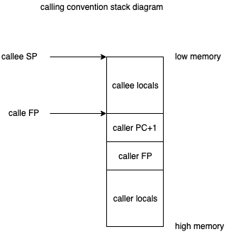

# VM

For this challange we're writing a virtual machine(vm) and assembler. The
virtual machine is not replicating any specific, existing, machine. The goal
is to learn how a computer works at a lower level. In the scope of Go, this
kind of project will show that it does have the capability of being a
"systems" language.


## The challange

The challanage is to implement a vm or an assembler for the architecture
written here.

## The architecture

The architecture describes features and attributes of the machine and its
components (memory, paging, etc).

* 8 bit memory addresses, instructions, and registers.
* 4 general purpose registers
* 3 internal registers that can only be accessed with the `ADR` instruction
    * `PC` (program counter) a pointer to the memory location of the
        currently executing instruction. It should be incremented after
        instructions that do not jump/branch.
    * `FP` (frame pointer) the base of the current stack frame. It is also
        where the return address will be stored.
    * `SP` (stack pointer) a pointer to the memory location at the top of the
        stack. A caveat is that the stack grows from high to low memory so,
        the "top of the stack" actually has the lowest address.
* A program is copied into memory starting at address 0.
* Address 0:
    * The first byte of a program (copied to address 0) must be a pointer to
        where execution should start.
    * after reading it for the first time, the VM should 0 it.
    * address 0 is also used to exit the program, by `CAL`-ing to it.
    * *optional*: during execution, address could be used for a few things,
        which are not assumed in the examples.
        * c-like `errno`
        * a status register for flags like overflow after addition


## The instruction set

Now that we know roughly the architecture, we can describe the instructions
and their encoding. Once again, the instructions are 8 bits. And for our
instruction set, the first 4 bits of the isntruction denote the op code.
The rest of the bits are used to denote 1 or 2 registers, or an immediate
4-bit constant.

| mnemonic | meaning | op code | r1 | r2 | imm | c code |
| - | - | - | - | - | - | - |
| LDR | load register         | 0  | dest | source | | `dest = *source`         |
| STR | store register        | 1  | dest | source | | `*dest = source`         |
| LDI | load immediate        | 2  |      |        | const | `r0 = const`       |
| MOV | move, register        | 3  | dest | source | | `dest = source`          |
| POP | pop from stack        | 4  | reg  |        | | `reg = *SP++`            |
| PSH | push to stack         | 5  | reg  |        | | `*--SP = reg`            |
| BNZ | branch if not zero    | 6  | pred | loc    | | `if (pred) { PC = loc }` |
| CAL | call function         | 7  | loc  | ret    | | see below                |
| ADR | mov from internal reg | 8  | greg | ireg   | | `greg = ireg`            |
| ADD | add                   | 9  | dest | source | | `dest += source`         |
| SHR | shift right           | 10 | dest | source | | `dest <<= source`        |
| AND | bitwise and           | 11 | dest | source | | `dest &= source`         |
| ORR | bitwise or            | 12 | dest | source | | `dest \|= source`        |
| EOR | bitwise exclusive or  | 13 | dest | source | | `dest ^= source`         |
| OST | output string         | 14 | rptr | rlen   | | `write(1, *rptr, rlen)`  |
| IST | input string          | 15 | rptr | rlen   | | `read(0, *rptr, rlen)`   |

```
// CAL
if (ret) {
    PC = *FP;
    SP = FP - 2;
    FP = *(FP - 1);
} else if (!loc) {
    // exit the program
    // and the exit code is at address 0
    exit(*0);
} else {
    *--SP = FP;
    *--SP = PC + 1;
    FP = SP;
    PC = loc;
}
```

| registers | encoding value |
| - | - |
| R0 | 0 |
| R1 | 1 |
| R2 | 2 |
| R3 | 3 |
| PC | 0 |
| FP | 1 |
| SP | 2 |

*note*: the internal registers read-only to user code, and read via the `ADR`
instruction.


The data structure for an instruction is a byte and it has methods to extract
each of the possible parameters.

### The calling convention

Implicit to this instruction set is the calling convention, or how functions
are called and returned. Here are the steps for calling:
1. The current frame pointer is pushed to the stack
2. The program counter + 1 (in memory, the next instruction/the instruction
    to return to/the return address) is pushed to the stack.
3. The stack pointer (pointing to the return address) is copied onto the
    frame pointer
4. The "CPU" continues executing at the address in the program counter

At this point, the new function will run and push and pop from the stack. It
should be noted that `FP` will not change in a "leaf function" (a function
that makes no calls). In a non-leaf function, as we'll see, `FP` will be the
same after the callee excutes `RET`. To execute `RET` the stack does not
have to be empty, although, it cannot have `POP`-ed off th `PC` and `FP`
values.

For returning, we just take the values we stored when `CAL`-ing and move
them to the appropriate registers:
1. The the value at the current frame pointer (where we stored the
    return address) is moved to the program counter.
2. The frame pointer - 2 is moved to the stack pointer.
3. The value at frame pointer - 1 is moved to the frame pointer.



### Parameters

The instruction set does not imply a certain calling convention, though
it is easier to pass, up to 4, arguments via registers rather than the
stack. To get more arguments passed on the stack it is possible to use
`ADR R1, FP` and `ADD`-ing to the `R1`, or whatever register should be
used.

## The VM

The vm is a pretty simple structure. It contains the registers and memory
for the architecture. The vm type will also have methods
for `Load`-ing and then `Execute`-ing a binary. It is recommended that
evaluation of the intructions is done in a loop with the `Execute` method.

## The Assembly language

The assembly language should be familiar to anyone who's worked with assembly
before. It has the following syntax:
```text
(; [^\n]*)*
start (label)
(section (data | text)
((label:)? (directive arg (, arg)*)? (; [^\n]*))*
)+
```
In english:
* a comment starts with ';' and goes until the end of the line
* the file may start with 0 or more comment lines
* the first functional statement in the file must be `start` and a
    label with denotes the first instruction to execute
* the rest of the file is 1 or more `section` blocks
    * a section block must be either `text` or `data`
    * a section block is 1 or more `line`s
        * a `line` consists of a `label`, `directive`, or `comment` or
            any combination of the three in this order

One thing to note is that a `directive` does not necessarilly align with an
instruction. For example, data processing directives might be accepted by
the assembler with an immediate value argument for the assembler to then
generate `LDI` instructions.

## Helpful hints

* the [`xxd` and `xxd -r`](https://manpage.me/index.cgi?apropos=0&q=xxd&sektion=0&manpath=Darwin+7.0.1&arch=default&format=ascii)
    command will change a file from binary to a hexdump and back.
* [`hex.Dump`](https://golang.org/pkg/encoding/hex/#Dump) is similar, but as
    a Go function it might be useful for debugging.

